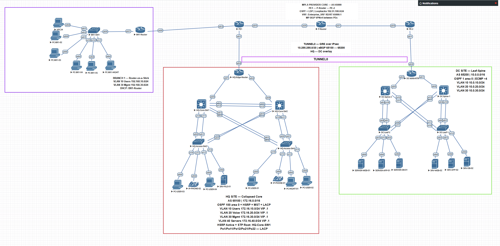

# Enterprise Network Lab

A multi-site enterprise WAN built in EVE-NG. Three customer sites connected over a simulated MPLS L3VPN provider core, with a GRE/IPsec overlay between headquarters and the data centre.

Each site is deliberately built on a different design pattern, chosen to match its scale.



---

## Sites

| Site | Pattern | ASN | Address Space |
|---|---|---|---|
| **HQ** | Collapsed Core | 65100 | `172.16.0.0/16` |
| **DC** | Leaf-Spine, routed access | 65200 | `10.0.0.0/16` |
| **Branch 1** | Router-on-a-Stick | 65300 | `192.168.0.0/16` |
| **Provider** | MPLS L3VPN | 65000 | `192.51.100.0/24` |

---

## What This Demonstrates

**Campus design** — HSRP, MST with per-instance load balancing, LACP Port-Channels, dual-homed access switches.

**Data centre design** — routed leaf-spine fabric with 4-way ECMP and no spanning tree. Every link forwards traffic.

**Branch design** — single router, 802.1Q sub-interfaces, static routing to the provider.

**Service provider** — MPLS core with OSPF and LDP, VRF-based L3VPN, MP-BGP VPNv4 between PE routers, three different PE-CE arrangements.

**Overlay** — GRE over IPsec carrying eBGP between two customer sites.

---

## Documentation

| Document | Contents |
|---|---|
| [`docs/ADDRESSING_AND_ROUTING.md`](docs/ADDRESSING_AND_ROUTING.md) | Full IP plan, ASNs, routing protocols, VRF and VPNv4 |
| [`docs/SITE_DESIGNS.md`](docs/SITE_DESIGNS.md) | Why each site is built the way it is, and the trade-offs |
| [`docs/LAB_NOTES.md`](docs/TROUBLESHOOTING.md) | Problems encountered, root causes, and what they taught |

---

## Repository Layout

```
.
├── README.md
├── docs/
│   ├── ADDRESSING_AND_ROUTING.md
│   ├── SITE_DESIGNS.md
│   ├── LAB_NOTES.md
│   └── screenshots/
├── configs/
│   ├── hq/
│   ├── dc/
│   ├── branch/
│   └── provider/
└── topology/
    ├── topology.png
    └── ENTERPRISE_NETWORK_project.unl
```

`configs/` holds the running configuration of every device, grouped by site. `topology/` contains the EVE-NG project file, so the lab can be imported and run as-is.

---

## Design Comparison

| | HQ | DC | Branch |
|---|---|---|---|
| Inter-layer links | Port-Channel (LACP) | Routed `/30` | Single trunk |
| Traffic distribution | LACP, Layer 2 | ECMP in OSPF, Layer 3 | None |
| Loop prevention | MST | No loop exists | No loop exists |
| Gateway | HSRP virtual IP | Local SVI per leaf | Router sub-interface |
| Redundancy | HSRP + Po + MST | 4-way ECMP | None |

The same pattern applied everywhere would be wrong in two of the three places. Building the branch like HQ means four switches and an FHRP for twenty users. Building HQ like the branch puts every flow through one router on one cable. Building the DC like HQ leaves half the links blocked by STP, in the one place where east-west bandwidth matters most.

---

## Built With

- EVE-NG Community Edition
- Cisco IOL / IOU images (L2 and L3)
- VPCS for end hosts

Scope is a private enterprise WAN. Internet edge, NAT and DMZ are not included.

---

## Selected Findings

Three issues from `docs/LAB_NOTES.md` that were worth the time they cost:

**A static route that looked valid and dropped everything.** Its next-hop did not exist, but resolved recursively through a `Null0` discard route — so it installed cleanly and black-holed the traffic in silence.

**A backup path concealing a dead one.** VPNv4 peering between the PEs never came up. Nobody noticed, because HQ and the DC talk over a tunnel that bypasses the MPLS core. Adding a branch with no tunnel exposed it in minutes.

**A one-way virtual link impersonating a routing bug.** Hours of protocol debugging ended at an interface counter frozen at 26 packets while the peer's output counter climbed. Nothing was arriving. Redrawing the cable fixed it in thirty seconds.
